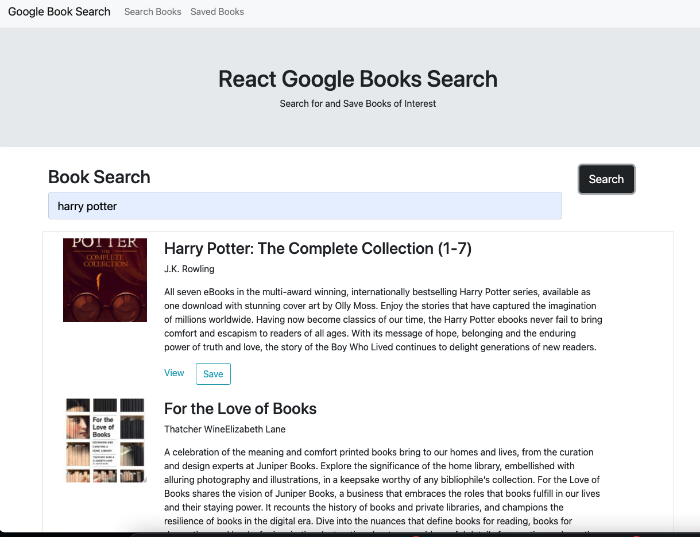
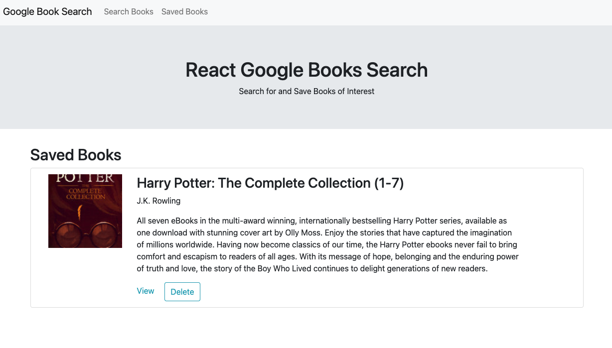

# Google-Books-Search

## Description

* This is a React-based Google Books Search app. Users can search books with Google Books API and save them for future reference.

## Technologies Used
HTML/CSS/JavaScript
React
Node.js
Axios

## Screenshots

## Links

* Heroku Link:https://salty-headland-20840.herokuapp.com/
* GitHub repositories: https://github.com/mengyue-z/Google-Books-Search

